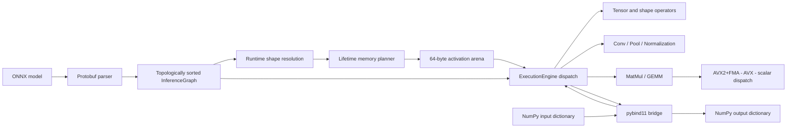

# nn_inference

A compact C++17 ONNX CPU inference runtime built from scratch for ResNet-18 and a two-layer BERT-tiny encoder with a tied-embedding masked-token logit head.

The runtime includes:

- ONNX protobuf parsing and topological graph construction
- 64-byte-aligned tensors with strided views
- NumPy-style broadcasting and dynamic shape/index operators
- im2col Conv2D, normalization, pooling, batched MatMul, Softmax, and GELU primitives
- scalar, AVX, and AVX2/FMA GEMM paths with runtime CPU dispatch
- lifetime-based activation arena planning
- a pybind11 `ExecutionEngine.run(inputs_dict)` interface
- direct ONNX Runtime comparison tests and model-level validation tools

## Architecture



The planner computes producer/last-consumer lifetimes, greedily reuses non-overlapping slots, aligns every slot to 64 bytes, and skips unresolved dynamic tensors. Runtime graph outputs are cloned before returning so they remain valid across later calls.

## Supported operators

ResNet-18:

`Conv`, `BatchNormalization`, `Relu`, `MaxPool`, `GlobalAveragePool`, `Flatten`, `Gemm`, `Add`, `Mul`, `Reshape`, and `Transpose`.

BERT-tiny and shape plumbing:

`Constant`, `Shape`, `Gather`, `MatMul`, `ReduceMean`, `Softmax`, `Concat`, `Slice`, `Cast`, `Expand`, `Squeeze`, `Unsqueeze`, `Sub`, `Div`, `Pow`, `Sqrt`, `Erf`, `Where`, and `LayerNormalization`.

The downloaded BERT encoder expresses LayerNorm and GELU as primitive ONNX operations. A direct `LayerNormalization` implementation is also tested.

## Build

Requirements: Linux x86-64, CMake 3.20+, Ninja, a C++17 compiler, Python 3.10+, and at least 8 GB RAM. Keep builds at two jobs.

Debug with AddressSanitizer and UBSan:

```bash
cmake -S . -B build -G Ninja \
  -DCMAKE_BUILD_TYPE=Debug \
  -DNN_ENABLE_SANITIZERS=ON \
  -DCMAKE_POLICY_VERSION_MINIMUM=3.5
cmake --build build --parallel 2
cd build
ASAN_OPTIONS=detect_leaks=0:verify_asan_link_order=0 \
  ctest --output-on-failure
```

Optimized benchmark build:

```bash
cmake -S . -B build-release -G Ninja \
  -DCMAKE_BUILD_TYPE=Release \
  -DNN_ENABLE_SANITIZERS=OFF \
  -DCMAKE_POLICY_VERSION_MINIMUM=3.5
cmake --build build-release --parallel 2
```

CMake FetchContent pins Protobuf 21.12, ONNX 1.15.0, pybind11 2.11.1, and Catch2 3.5.2.

## Python API

```bash
PYTHONPATH=build-release/python:python .venv/bin/python - <<'PY'
import numpy as np
import nn_inference

engine = nn_inference.ExecutionEngine("models/resnet18-opset13.onnx")
x = np.zeros((1, 3, 224, 224), dtype=np.float32)
y = engine.run({"data": x})["resnetv15_dense0_fwd"]
print(y.shape)
print(engine.get_planned_activation_bytes())
PY
```

Accepted NumPy dtypes are `float32`, `int64`, `int32`, `bool`, and `uint8`. Non-contiguous inputs are copied safely, and outputs are returned as owned NumPy arrays.

## Validation

ResNet-18, 100 ImageNet-derived Imagenette validation images:

```bash
PYTHONPATH=build-release/python:python .venv/bin/python \
  python/validate.py \
  models/resnet18-opset13.onnx \
  data/imagenette2-160/val \
  --n 100 --synset-file data/synset.txt
```

BERT-tiny, 50 masked sentences and full 30,522-token logits:

```bash
PYTHONPATH=build-release/python:python .venv/bin/python \
  python/validate_bert.py \
  models/bert-tiny-mlm-opset13.onnx \
  data/bert-vocab.txt --n 50
```

The BERT artifact starts from the public `prajjwal1/bert-tiny` encoder ONNX graph, is converted to opset 13, and receives a tied word-embedding projection through `python/add_mlm_head.py`. This produces vocabulary logits for runtime numerical validation; it does not recreate the original checkpoint's omitted pretrained MLM transform/bias layers.

### Numerical results

| Validation | Result | Required |
|---|---:|---:|
| ResNet-18 mean absolute error vs ORT, 100 images | `2.0942e-6` | `< 5e-3` |
| ResNet-18 max absolute error | `2.4796e-5` | - |
| ResNet-18 prediction agreement | `100%` | - |
| ResNet-18 ORT / engine top-1 | `98% / 98%` | within `0.5%` |
| BERT-tiny mean logit MSE, 50 sentences | `4.0134e-13` | `< 1e-3` |
| BERT-tiny max absolute logit error | `6.3032e-6` | - |
| Direct BERT primitive comparisons | `60 passed` | 3 shapes/operator |

## Benchmarks

Measured in WSL Release mode on an Intel Xeon E5-1650 v2. ONNX Runtime uses one intra-op and one inter-op thread. Engine GEMM dispatch uses at most six threads only for matrices above 100 million scalar multiply-add triplets; set `NN_GEMM_THREADS` to override it.

| Workload | Engine mean | ORT single-thread mean | Engine throughput |
|---|---:|---:|---:|
| ResNet-18, batch 1, 5 measured runs | `965.59 ms` | `83.14 ms` | `1.036 images/s` |
| BERT-tiny MLM, `[1,16]`, 5 measured runs | `123.65 ms` | `6.88 ms` | `8.087 sentences/s` |
| GEMM `1024x1024 - 1024x1024`, 7 runs | `42.300 GFLOPS/s` mean | - | `49.696 GFLOPS/s` best |

Run the benchmarks:

```bash
NN_GEMM_THREADS=6 build-release/gemm_bench 7

PYTHONPATH=build-release/python:python .venv/bin/python python/bench.py \
  models/resnet18-opset13.onnx data/imagenette2-160/val \
  --warmup 1 --runs 5

PYTHONPATH=build-release/python:python .venv/bin/python python/bench.py \
  models/bert-tiny-mlm-opset13.onnx data/bert-vocab.txt \
  --bert --warmup 1 --runs 5
```

This physical CPU supports AVX but not AVX2/FMA, so the local throughput number uses the AVX fallback. The AVX2/FMA kernel is compiled with a target attribute, contains emitted FMA instructions, and its numerical branch is executed under a workspace-local Haswell QEMU CPU. A native AVX2 throughput measurement requires the target hardware described by the project specification.

## Memory planner

The controlled sequential-activation benchmark retains sixteen 16 MB activations in na-ve mode and reuses one 16 MB arena slot in planned mode:

```bash
/usr/bin/time -f 'peak_rss_kb=%M' build-release/memory_bench planned
/usr/bin/time -f 'peak_rss_kb=%M' build-release/memory_bench naive
```

| Mode | Planned activation bytes | Na-ve activation bytes | Peak RSS |
|---|---:|---:|---:|
| Planner enabled | `16,777,216` | `268,435,456` | `53,828 KB` |
| Planner disabled | `0` | `268,435,456` | `299,684 KB` |

Peak RSS is reduced by `82.0%`, exceeding the required 20% reduction.

## Test coverage

The test suite includes:

- Tensor allocation, reshape, transpose, slice, non-contiguous copies, and dtype checks
- scalar, AVX, and AVX2/FMA GEMM correctness
- graph sorting and error handling
- activation lifetime/arena safety and retained-output lifetime
- native operator tests
- NumPy GEMM comparisons
- 39 ResNet operator cases against ONNX Runtime
- 60 BERT primitive cases against ONNX Runtime
- Python binding conversion tests
- three-shape BERT encoder integration
- 50-sentence BERT MLM logit validation

## Sample output

```text
ResNet-18 validation: {'images': 100,
 'mean_abs_error': 2.094225548e-06,
 'top1_agreement': 1.0,
 'ort_top1_accuracy': 0.98,
 'engine_top1_accuracy': 0.98}

BERT-tiny MLM validation: {'sentences': 50,
 'logit_mse': 4.013366131e-13,
 'max_abs_error': 6.303191185e-06}

backend=avx runs=7 mean_gflops=42.300 best_gflops=49.696
```