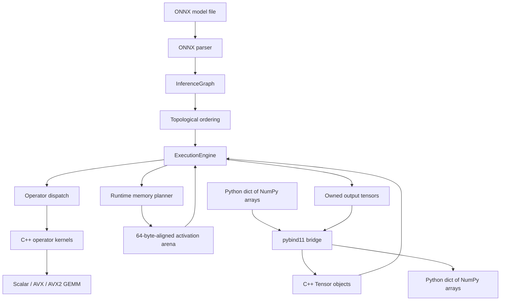

# nn_inference v1: Complete Technical Guide

This document explains the entire `nn_inference` project in beginner-friendly language. It is intentionally much more detailed than the README. The README is the short public introduction; this guide is the study manual you can use to understand the code, demonstrate it, and answer technical questions about it.

The project is intentionally frozen at **v1 scope** for now. GPU/CUDA execution, general-purpose multithreading, INT8 quantization, and training are not part of v1. The only multithreading currently present is a bounded optimization inside large GEMM calls.

---

## 1. The project in one sentence

`nn_inference` is a small neural-network **inference runtime** written mainly in C++17 that reads ONNX models, builds an internal computation graph, executes supported operators on the CPU, reuses activation memory, and exposes the result to Python through NumPy arrays.

An easier version of that sentence is:

> It loads an already-trained neural network and performs its calculations without using a full deep-learning framework such as PyTorch or TensorFlow.

---

## 2. What problem does it solve?

Training a neural network produces learned parameters called **weights**. After training, we usually want to use those weights to make predictions. That prediction step is called **inference**.

A trained model is not only a file full of numbers. It also describes a sequence of mathematical operations. For example, an image model may perform convolution, normalization, ReLU, pooling, and matrix multiplication. A language model may perform embedding lookup, matrix multiplication, normalization, attention-related shape changes, Softmax, and GELU.

Someone must:

1. Read the model file.
2. Understand its tensors, weights, operators, attributes, inputs, and outputs.
3. Put the operators into a valid execution order.
4. Allocate memory for temporary values.
5. Execute every operator correctly.
6. Return the final result.

Libraries such as ONNX Runtime already do all of this at production scale. This project implements a deliberately smaller version from scratch so that the underlying systems concepts are visible and understandable.

The project is valuable as a systems and machine-learning engineering project because it combines:

- binary model parsing;
- graph algorithms;
- tensor representation;
- numerical computing;
- CPU vector instructions;
- memory-lifetime analysis;
- C++ resource management;
- Python/C++ interoperability;
- testing against an independent reference implementation;
- real image and language-model validation.

---

## 3. What this project is—and is not

### It is

- A CPU-only ONNX inference runtime.
- A learning-focused but functional systems project.
- A C++ implementation with a Python-facing API.
- Designed around ONNX opset 13 models.
- Validated on ResNet-18 and a two-layer BERT-tiny encoder with a tied-embedding MLM projection.
- Able to choose scalar, AVX, or AVX2/FMA GEMM at runtime.
- Able to reuse temporary activation memory based on tensor lifetimes.

### It is not

- A training framework.
- A replacement for PyTorch, TensorFlow, or ONNX Runtime.
- A universal ONNX implementation.
- A GPU runtime.
- A fully parallel execution engine.
- An INT8 or mixed-precision runtime.
- A security-hardened service for arbitrary untrusted model uploads.
- Expected to outperform ONNX Runtime end to end.

This distinction matters when presenting the project. Its achievement is not “I made a faster ONNX Runtime.” Its achievement is “I implemented and validated the important pieces of a neural-network runtime and can explain how those pieces work together.”

---

## 4. Essential beginner concepts

### 4.1 Neural network

A neural network is a collection of mathematical operations whose behavior is controlled by learned numbers called parameters or weights.

### 4.2 Training

Training repeatedly compares predictions with correct answers and changes the weights to reduce error. This project does not train models.

### 4.3 Inference

Inference uses fixed, already-trained weights to calculate an output from an input. This is what the project implements.

### 4.4 Tensor

A tensor is a multidimensional array. A scalar is rank 0, a vector is rank 1, a matrix is rank 2, and an image batch is commonly rank 4.

For example, a ResNet input has shape `[1, 3, 224, 224]`:

- `1`: batch size;
- `3`: red, green, and blue channels;
- `224`: height;
- `224`: width.

### 4.5 Shape, rank, and element count

- **Shape** gives the size of every axis, such as `[2, 3, 4]`.
- **Rank** or `ndim` is the number of axes; `[2, 3, 4]` has rank 3.
- **Element count** or `numel` is the product of the dimensions; `2 * 3 * 4 = 24`.
- **Byte count** depends on element count and data type; 24 `float32` values occupy `24 * 4 = 96` bytes.

### 4.6 Stride

A stride tells the runtime how far to move in memory when an index changes along an axis. For a contiguous row-major tensor of shape `[2, 3, 4]`, the strides are `[12, 4, 1]`.

Strides allow transpose and slice operations to create lightweight **views** instead of copying all data. A view shares storage with another tensor but interprets it with a different shape, stride, or starting offset.

### 4.7 Operator

An operator is one computation, such as `Add`, `Conv`, `Relu`, or `MatMul`. In the graph, each operator is represented by an `OpNode`.

### 4.8 Graph

The model is a directed graph. Operators are nodes, and tensors connect one node’s output to another node’s input. The arrows represent data dependencies.

### 4.9 Initializer

An ONNX initializer is a tensor stored inside the model, normally a learned weight or constant. Initializers are available before execution starts.

### 4.10 Activation

An activation is an intermediate tensor produced while the model runs. Most activations are temporary, which makes their memory reusable after their last consumer finishes.

### 4.11 ONNX

ONNX is a portable model format. It stores a graph, tensor metadata, weights, operator attributes, model inputs, and model outputs using Protocol Buffers.

### 4.12 ONNX opset

An opset is a versioned definition of ONNX operator behavior. This project targets opset 13. Operator rules can change across opsets, so “supports ONNX” is incomplete without an opset and operator list.

### 4.13 SIMD, AVX, AVX2, and FMA

SIMD means “single instruction, multiple data.” It lets one CPU instruction process several numbers at once.

- AVX works with eight `float32` values in a 256-bit register.
- AVX2 extends AVX capabilities.
- FMA performs multiplication and addition in one instruction, useful for matrix multiplication.

The executable checks CPU capabilities at runtime. It does not execute AVX2/FMA instructions on an unsupported CPU.

---

## 5. Technology stack

| Technology | Role in the project |
|---|---|
| C++17 | Core runtime, tensors, graph, parser, operators, memory planning, and optimized kernels |
| CMake 3.20+ | Configures dependencies and build targets |
| Ninja | Fast build tool used by the documented commands |
| Protocol Buffers 21.12 | Deserializes the binary ONNX model representation |
| ONNX 1.15.0 | Supplies ONNX protobuf types and model definitions |
| pybind11 2.11.1 | Creates the Python extension module around the C++ engine |
| Catch2 3.5.2 | C++ unit-test framework |
| Python 3.10+ | Model preparation, preprocessing, validation, and benchmarks |
| NumPy | Array handling and numerical comparisons |
| ONNX Runtime | Independent reference implementation used to check correctness and performance |
| Pillow | Image loading, resizing, cropping, and RGB conversion |
| AddressSanitizer | Detects invalid C++ memory access in debug builds |
| UndefinedBehaviorSanitizer | Detects many forms of undefined C++ behavior |
| AVX/AVX2 intrinsics | Explicit CPU-vectorized GEMM implementation |
| WSL/Linux tools | Main development and measurement environment |

Dependencies are pinned in `CMakeLists.txt` through CMake `FetchContent`. This improves reproducibility because future dependency releases will not silently change the build.

---

## 6. High-level architecture



The runtime has five main layers:

1. **Model layer:** parses the ONNX file into internal structures.
2. **Data layer:** represents multidimensional data with `Tensor`.
3. **Planning layer:** sorts operators and plans reusable memory.
4. **Execution layer:** validates inputs and dispatches operators in order.
5. **Integration layer:** converts between NumPy arrays and C++ tensors.

---

## 7. End-to-end execution flow

When Python executes:

```python
engine = nn_inference.ExecutionEngine("models/resnet18-opset13.onnx")
outputs = engine.run({"data": input_array})
```

the following happens.

### Step 1: Load the file

The string constructor of `ExecutionEngine` calls `load_onnx(model_path)`.

### Step 2: Deserialize ONNX

`load_onnx` opens the file in binary mode and asks Protocol Buffers to deserialize it into `onnx::ModelProto`.

### Step 3: Build the internal graph

The parser extracts:

- the model name;
- ONNX opset version;
- input and output names;
- tensor data types and shapes;
- symbolic dynamic dimensions;
- initializers such as weights;
- nodes, inputs, outputs, and attributes.

### Step 4: Topologically sort nodes

The graph is reordered so that each tensor producer runs before its consumers. The implementation uses Kahn’s algorithm and rejects dependency cycles and duplicate tensor producers.

### Step 5: Convert Python inputs

The binding accepts a Python dictionary whose values must be NumPy arrays. Supported types are `float32`, `int64`, `int32`, `bool`, and `uint8`.

Non-contiguous NumPy inputs are converted to C-contiguous arrays before being copied into C++ tensors.

### Step 6: Validate inputs

The engine verifies that every required input exists and that its data type, rank, and fixed dimensions match the model. Dynamic dimensions represented by `-1` may vary.

### Step 7: Resolve dynamic symbols

If an input dimension has a symbolic name such as `batch` or `sequence`, the engine records the runtime value and substitutes it into matching tensor metadata where possible.

### Step 8: Plan activation memory

The memory planner calculates when every known-size intermediate tensor is born and when it is used for the final time. Non-overlapping lifetimes can share a physical arena slot.

### Step 9: Execute each node

For every node, `ExecutionEngine::dispatch` chooses the corresponding kernel. The kernel reads named input tensors from `tensor_map_`, calculates an output, and stores it under the output name.

### Step 10: Materialize planned outputs

If an output has a planned arena slot, the engine copies it into that slot and replaces the temporary tensor with an external view of the arena memory.

### Step 11: Profile if requested

When profiling is enabled, the engine records elapsed milliseconds for every named node. Repeated names accumulate time.

### Step 12: Return safe outputs

Graph outputs are cloned into independently owned contiguous tensors. This is essential because arena memory will be reused by later calls. The Python bridge then copies those tensors into owned NumPy arrays.

---

## 8. Core C++ data structures

### 8.1 `Tensor`

Files: `include/nn/tensor.hpp` and `src/tensor.cpp`.

`Tensor` stores:

- `shape_`: size of each dimension;
- `strides_`: memory step for each dimension;
- `dtype_`: element type;
- `storage_`: shared ownership of an allocation;
- `byte_offset_`: where a view begins inside the allocation.

Supported data types:

- `FLOAT32` — most model calculations and weights;
- `INT64` — BERT token IDs and shape/index operations;
- `INT32` — integer model values;
- `BOOL` — logical masks and `Where` conditions;
- `UINT8` — byte-valued tensors.

Owned allocations are 64-byte aligned. Alignment helps SIMD access and keeps the design ready for wider vector instructions.

Important operations:

- `reshape`: changes shape without changing element count. A contiguous tensor can share storage; a non-contiguous tensor is first materialized in logical order.
- `transpose`: returns a view with reordered shape and strides.
- `slice`: returns a strided view with a changed starting offset.
- `clone_contiguous`: creates an independent contiguous copy in logical element order.
- `fill_zeros`: writes zero into every logical element, including a non-contiguous view.
- `copy_to_bytes`: copies contiguous data directly or walks a non-contiguous view logically.
- typed accessors such as `data_f32`: reject access through the wrong data type.

The class uses `std::shared_ptr<void>` so views can keep owned storage alive. An external-data tensor uses a no-op deleter because the external owner—such as the execution arena—controls the memory lifetime.

### 8.2 `AttributeValue`

An ONNX node attribute can contain an integer, float, string, list of integers, list of floats, or tensor. `AttributeValue` is the project’s internal tagged representation of those choices.

### 8.3 `TensorInfo`

`TensorInfo` describes a tensor without holding its runtime data:

- name;
- data type;
- shape;
- optional symbolic dimension names;
- whether shape information exists.

A negative dimension means the concrete size is unresolved.

### 8.4 `OpNode`

`OpNode` stores:

- node name;
- operator type;
- ordered input names;
- ordered output names;
- attributes.

Its helper functions return typed attributes and throw when an attribute exists with the wrong type.

### 8.5 `InferenceGraph`

`InferenceGraph` is the complete internal model:

- topologically sorted nodes;
- value metadata;
- initializer tensors;
- external input names;
- output names;
- model name;
- opset version.

### 8.6 `TensorLifetime` and `MemoryPlan`

`TensorLifetime` contains the producer index, final consumer index, and byte size of one activation.

`MemoryPlan` maps tensor names to arena slots. A slot is an offset and a size. `total_bytes` is the full required arena size.

### 8.7 `ExecutionEngine`

`ExecutionEngine` owns the graph, memory plan, arena, tensor map, profiling state, and timing results.

Its main public methods are:

- constructors from an `InferenceGraph` or ONNX path;
- `run(inputs)`;
- `set_profiling(bool)`;
- `get_op_times_ms()`;
- `set_memory_planner(bool)`;
- `get_planned_activation_bytes()`;
- `get_naive_activation_bytes()`.

---

## 9. ONNX parser in detail

Files: `include/nn/onnx_parser.hpp` and `src/onnx_parser.cpp`.

The parser supports ONNX tensor values only. It maps ONNX types into the five internal data types and rejects unsupported types.

Initializer data may be stored as:

- `raw_data`, a byte string;
- `float_data`;
- `int64_data`;
- `int32_data`.

The parser checks that the number of stored bytes or values exactly matches the tensor shape. This avoids silently accepting truncated or oversized weights.

External ONNX tensor data is not supported. All weights must be embedded in the model file.

The parser also:

- excludes initializers from external model inputs;
- accepts standard-domain opset imports;
- stores symbolic dimensions as `-1` plus their names;
- rejects duplicate attributes on one node;
- rejects empty initializer names;
- produces descriptive errors for missing or malformed files.

---

## 10. Topological sorting

File: `src/graph.cpp`.

ONNX normally stores nodes in execution order, but the runtime should not blindly depend on that. The sorter first maps every tensor output to its producer. It then calculates each node’s number of unresolved producer dependencies.

Nodes with zero dependencies enter a priority queue. The smallest original index is selected first, which keeps the result stable when multiple orders are valid. When a producer is emitted, the dependency count of its consumers decreases. A consumer becomes ready at zero.

If fewer nodes are emitted than exist in the graph, a dependency cycle exists. Neural-network inference graphs used here must be acyclic.

Complexity is approximately `O(V + E)`, where `V` is the number of nodes and `E` is the number of producer-to-consumer relationships.

---

## 11. Memory planner in detail

Files: `include/nn/memory_planner.hpp` and `src/memory_planner.cpp`.

Without planning, every intermediate tensor can receive a separate allocation. Even if a tensor becomes useless early, its memory may remain allocated. Large models can therefore require much more memory than their live data actually needs.

The planner performs these steps:

1. Find the node that produces every non-initializer tensor.
2. Find the final node that consumes it.
3. Keep graph outputs alive through the end of execution.
4. Skip inputs, initializers, unknown shapes, zero-byte tensors, and unresolved dimensions.
5. Sort activations from largest to smallest.
6. Reuse the smallest existing physical slot that is large enough and whose assignments do not overlap in time.
7. Create a new 64-byte-aligned slot when no compatible slot exists.

Two lifetimes can reuse memory if one ends at or before the other begins. This boundary rule is safe because an operator may consume an input and produce an output during the same node execution; the produced value is moved into the arena after the kernel finishes.

The controlled benchmark demonstrates:

- naive activation total: 268,435,456 bytes;
- planned arena: 16,777,216 bytes;
- naive peak RSS: 299,684 KB;
- planned peak RSS: 53,828 KB;
- measured peak-RSS reduction: 82.0%.

The planned byte count is an arena calculation. Peak RSS also includes executable code, dependencies, weights, stacks, and allocator overhead, so the two numbers should not be confused.

---

## 12. Operator execution

Operator functions use this pattern:

```cpp
void operation(
    const OpNode& node,
    std::unordered_map<std::string, Tensor>& tensors);
```

The node supplies input/output names and attributes. The map supplies actual runtime tensors. A kernel validates its assumptions, computes a result, and inserts that result under the output name.

### 12.1 Elementwise and view operations

File: `src/ops/elementwise.cpp`.

- `Add`, `Mul`, `Sub`, `Div`, and `Pow` use NumPy-style broadcasting.
- `Sqrt` and `Erf` apply unary functions element by element.
- `Relu` computes `max(0, x)`.
- `Reshape` reads the target shape from another tensor and supports one inferred `-1` dimension.
- `Flatten` combines dimensions around an `axis`.
- `Transpose` reorders axes and normally returns a view.

Broadcasting aligns shapes from the right. A dimension is compatible when both values match or either value is 1. For example, `[1, C, 1, 1]` can broadcast across `[N, C, H, W]`.

### 12.2 Convolution

File: `src/ops/conv2d.cpp`.

The implementation supports NCHW float32 input, weights, optional bias, padding, stride, dilation, and groups.

It uses the **im2col** strategy:

1. Extract every input patch into rows of a temporary matrix.
2. Treat convolution weights as another matrix.
3. Multiply them using GEMM.
4. Add bias.
5. place results into `[N, output_channels, output_height, output_width]`.

This is easier to validate and optimize than a deeply specialized direct-convolution implementation, although it creates a potentially large temporary matrix.

### 12.3 Batch normalization

File: `src/ops/norm.cpp`.

Inference-mode BatchNorm calculates, per channel:

```text
normalized = (x - running_mean) / sqrt(running_variance + epsilon)
output = scale * normalized + bias
```

Training-time running-statistic updates are intentionally absent.

### 12.4 Pooling

File: `src/ops/pool.cpp`.

- `MaxPool` selects the largest valid value inside each spatial window.
- `GlobalAveragePool` averages every spatial position in each channel and produces spatial dimensions of size one.

### 12.5 GEMM

Files: `gemm.cpp`, `gemm_scalar.cpp`, `gemm_avx.cpp`, and `gemm_avx2.cpp`.

GEMM means general matrix multiplication:

```text
C = alpha * op(A) * op(B) + beta * C
```

The ONNX wrapper supports rank-2 float32 inputs, transpose attributes, `alpha`, `beta`, and broadcastable bias/input `C`.

The dispatcher uses an optimized path only when:

- `alpha == 1`;
- `beta == 0`;
- neither matrix is transposed;
- work exceeds one million `M*N*K` iterations;
- a suitable SIMD feature is available.

Otherwise it uses the general scalar implementation.

The AVX and AVX2 kernels use a 6-row by 16-column micro-kernel. Six output rows and sixteen output columns are accumulated while iterating over `K`. Remaining rows or columns use cleanup paths.

The AVX2 version uses fused multiply-add. Compiler target attributes allow the optimized function to exist in the same binary as portable code. Runtime CPU detection prevents illegal-instruction crashes.

For work of at least 100 million `M*N*K` operations, matrix rows may be split across up to six `std::thread` workers. `NN_GEMM_THREADS` can override the requested number, subject to row availability. This is a narrow GEMM optimization, not a general thread-pool execution engine.

### 12.6 BERT and shape operators

File: `src/ops/bert.cpp`.

- `Constant`: emits a tensor stored as a node attribute.
- `Shape`: returns input dimensions as an `int64` tensor.
- `Gather`: selects values along an axis using indices.
- `Concat`: joins tensors along an axis.
- `Unsqueeze`: inserts dimensions of size one.
- `Squeeze`: removes selected dimensions of size one.
- `Cast`: converts between supported data types.
- `Slice`: selects ranges using starts, ends, axes, and steps.
- `Expand`: broadcasts a tensor to a requested shape.
- `ReduceMean`: averages across selected axes.
- `Softmax`: subtracts the maximum for numerical stability, exponentiates, and divides by the sum.
- `MatMul`: supports vector/matrix and batched/broadcasted matrix multiplication behavior needed by BERT.
- `LayerNormalization`: normalizes the final axes and applies scale and bias.
- `Where`: selects corresponding elements from two broadcastable tensors using a boolean condition.

BERT attention is not implemented as one fused `Attention` operator. It emerges from ordinary ONNX operations such as MatMul, reshape, transpose, addition, division, Softmax, and another MatMul. This is useful because the implementation follows the exported graph rather than hiding the model logic in a special case.

GELU is likewise represented by primitive operations involving multiplication, addition, division, `Erf`, and constants.

---

## 13. Python bridge

File: `python/bindings.cpp`.

pybind11 creates a compiled Python module named `nn_inference`.

Input conversion:

1. Verify the value can be treated as a NumPy array.
2. Request C-contiguous storage.
3. Map the NumPy dtype to `Tensor::DataType`.
4. Allocate a C++ tensor.
5. Copy input values into it.

The Python Global Interpreter Lock is released while `engine.run` performs C++ inference, so the interpreter is not unnecessarily locked during the heavy calculation.

Output conversion always creates owned NumPy arrays and copies values in logical order. Python therefore does not retain a dangerous view into reusable engine memory.

Exposed Python API:

```python
engine = nn_inference.ExecutionEngine(model_path)
outputs = engine.run(inputs)
engine.set_profiling(True)
times = engine.get_op_times_ms()
engine.set_memory_planner(False)
planned = engine.get_planned_activation_bytes()
naive = engine.get_naive_activation_bytes()
```

---

## 14. Models used by the project

### 14.1 ResNet-18

ResNet-18 is a convolutional image-classification network. “Residual” connections add earlier activations to later activations, which helps deeper networks learn.

The project uses ResNet to validate:

- convolution;
- padding and stride;
- BatchNorm;
- ReLU;
- residual addition;
- pooling;
- flattening;
- final dense/GEMM execution;
- full image preprocessing and class prediction.

### 14.2 BERT-tiny

BERT is a transformer-based language model. BERT-tiny is a much smaller version suitable for this project’s limited memory and CPU budget.

The model consumes:

- `input_ids`: vocabulary IDs;
- `attention_mask`: which sequence positions contain real tokens;
- `token_type_ids`: segment IDs.

The public encoder graph is converted to opset 13. A tied word-embedding matrix is transposed and appended as a vocabulary projection, producing logits for all 30,522 vocabulary tokens.

Important limitation: this tied projection does not recreate omitted pretrained MLM transform and bias layers. It exists to validate the runtime’s numerical execution, not to claim full masked-language-model quality identical to the original training checkpoint.

### 14.3 Tokenizer

`BertTokenizer` performs a compact beginner-oriented version of BERT tokenization:

1. Split text into words, punctuation, and `[MASK]`.
2. Lowercase normal tokens.
3. Break unknown words into WordPiece fragments using `##` prefixes.
4. Add `[CLS]` and `[SEP]`.
5. truncate to the maximum sequence length.
6. Pad with `[PAD]`.
7. Create attention-mask and token-type arrays.

It is sufficient for controlled validation but is not a complete replacement for every behavior of Hugging Face tokenizers.

---

## 15. Image preprocessing

File: `python/preprocess.py`.

For each image:

1. Open it with Pillow.
2. Convert it to RGB.
3. Resize while keeping aspect ratio so the shorter side becomes 256 pixels.
4. Center-crop to `224 x 224`.
5. Convert pixels from `[0, 255]` into floating-point `[0, 1]`.
6. Normalize using ImageNet mean `[0.485, 0.456, 0.406]` and standard deviation `[0.229, 0.224, 0.225]`.
7. Change layout from HWC to NCHW.
8. Return contiguous float32 shape `[1, 3, 224, 224]`.

Preprocessing must match the model. Even a correct inference engine can appear inaccurate if resizing, channel order, normalization, or layout is wrong.

---

## 16. Building the project

The supported environment is Linux x86-64, including WSL, with:

- CMake 3.20 or newer;
- Ninja;
- GCC or Clang with C++17;
- Python 3.10 or newer;
- approximately 8 GB available RAM;
- internet access during the first dependency fetch.

Use two build jobs to respect the original memory budget.

### Debug build

```bash
cmake -S . -B build -G Ninja \
  -DCMAKE_BUILD_TYPE=Debug \
  -DNN_ENABLE_SANITIZERS=ON \
  -DCMAKE_POLICY_VERSION_MINIMUM=3.5
cmake --build build --parallel 2
```

This build is slower because AddressSanitizer and UndefinedBehaviorSanitizer add safety checks.

### Release build

```bash
cmake -S . -B build-release -G Ninja \
  -DCMAKE_BUILD_TYPE=Release \
  -DNN_ENABLE_SANITIZERS=OFF \
  -DCMAKE_POLICY_VERSION_MINIMUM=3.5
cmake --build build-release --parallel 2
```

Use Release mode for meaningful performance measurements.

### Important CMake targets

| Target | Purpose |
|---|---|
| `nn_inference_core` | Static core runtime library |
| `nn_inference` | Python extension module |
| `nn_inference_smoke` | Minimal executable proving the toolchain links |
| `test_tensor` | Tensor unit tests |
| `test_gemm` | GEMM unit tests |
| `test_graph` | Graph and ONNX-parser tests |
| `test_memory_planner` | Planner and arena-safety tests |
| `test_ops` | Native operator and engine tests |
| `gemm_dump` | Generates GEMM output for NumPy comparison |
| `gemm_bench` | Measures GEMM throughput |
| `model_runner` | Runs small generated ONNX models for reference comparisons |
| `memory_bench` | Controlled planned-versus-naive RSS benchmark |

---

## 17. Using the Python API

The build directory containing the compiled extension and the `python` helpers must be on `PYTHONPATH`.

```bash
PYTHONPATH=build-release/python:python .venv/bin/python - <<'PY'
import numpy as np
import nn_inference

engine = nn_inference.ExecutionEngine("models/resnet18-opset13.onnx")
input_tensor = np.zeros((1, 3, 224, 224), dtype=np.float32)
outputs = engine.run({"data": input_tensor})

for name, value in outputs.items():
    print(name, value.shape, value.dtype)
PY
```

Input dictionary keys must exactly match ONNX input names. Output dictionary keys are the ONNX graph output names. Use `python/inspect_model.py` or ONNX tools when unsure about names.

### Profiling example

```python
engine.set_profiling(True)
engine.run(inputs)
times = engine.get_op_times_ms()
for name, milliseconds in sorted(times.items(), key=lambda item: -item[1]):
    print(f"{name}: {milliseconds:.3f} ms")
```

### Disabling the memory planner

```python
engine.set_memory_planner(False)
outputs = engine.run(inputs)
print(engine.get_naive_activation_bytes())
```

This is mainly a diagnostic and benchmarking feature.

---

## 18. Testing and validation strategy

There are several levels of evidence.

### Level 1: C++ unit tests

Catch2 tests check individual classes and algorithms:

- tensor shape, stride, alignment, views, copies, dtypes, and errors;
- scalar and SIMD GEMM correctness;
- attribute access and graph ordering;
- parser metadata and malformed input handling;
- lifetime overlap and arena reuse;
- broadcasting and engine error handling.

### Level 2: NumPy comparison

`python/test_gemm_numpy.py` compares C++ GEMM with NumPy across different dimensions, transpose modes, `alpha`, and `beta`.

### Level 3: Single-operator ONNX Runtime comparison

Python scripts generate small ONNX models and compare their output with ONNX Runtime.

- ResNet operator suite: 39 cases.
- BERT primitive suite: 60 cases with multiple shapes and edge conditions.

### Level 4: Model integration tests

The complete ResNet and BERT graphs exercise interactions that isolated tests may miss.

### Level 5: Dataset validation

ResNet is run on 100 Imagenette validation images. BERT is run on 50 controlled masked sentences and returns full vocabulary logits.

### Running CTest

```bash
cd build
ASAN_OPTIONS=detect_leaks=0:verify_asan_link_order=0 \
  ctest --output-on-failure
```

The `ASAN_OPTIONS` setting avoids known integration noise from extension/dependency loading while preserving the important address and undefined-behavior checks used by this project.

---

## 19. Correctness results

### ResNet-18

| Measurement | Result |
|---|---:|
| Images | 100 |
| Mean absolute error against ONNX Runtime | `2.0942e-6` |
| Maximum absolute error | `2.4796e-5` |
| Prediction agreement | `100%` |
| ONNX Runtime top-1 | `98%` |
| This engine top-1 | `98%` |

Mean absolute error averages `abs(reference - engine)` over output values. Small differences are normal because floating-point operations may be accumulated in different orders.

### BERT-tiny

| Measurement | Result |
|---|---:|
| Sentences | 50 |
| Mean logit MSE | `4.0134e-13` |
| Maximum absolute logit error | `6.3032e-6` |

MSE squares each difference and averages it. The very small value is strong numerical agreement with the reference for the tested graph and inputs.

Correctness against ONNX Runtime means the implementation agrees for tested models and cases. It does not prove support for every valid ONNX graph.

---

## 20. Performance results

Measurements were taken in WSL Release mode on an Intel Xeon E5-1650 v2. ONNX Runtime was configured with one intra-op and one inter-op thread.

| Workload | Engine | ONNX Runtime | Engine throughput |
|---|---:|---:|---:|
| ResNet-18 batch 1 | `965.59 ms` | `83.14 ms` | `1.036 images/s` |
| BERT-tiny `[1,16]` | `123.65 ms` | `6.88 ms` | `8.087 sentences/s` |
| 1024³ GEMM | `42.300 GFLOPS/s` mean | not measured | `49.696 GFLOPS/s` best |

The model-level engine is slower than ONNX Runtime. This is expected because ONNX Runtime contains years of work in graph optimization, operator fusion, data layout, threading, cache-aware kernels, memory management, and hardware-specific libraries.

GFLOPS means billions of floating-point operations per second. Matrix multiplication commonly counts a multiply and an addition as two operations, so the approximate GEMM workload is `2*M*N*K`.

The host CPU supports AVX but not AVX2/FMA. Local results therefore use the AVX path. The AVX2/FMA numerical branch was validated under a Haswell-emulated QEMU CPU, but native AVX2 throughput must be measured on compatible physical hardware.

---

## 21. Benchmark commands

### GEMM

```bash
NN_GEMM_THREADS=6 build-release/gemm_bench 7
```

The argument is the number of measured runs. `NN_GEMM_THREADS` controls the large-GEMM worker count.

### ResNet

```bash
PYTHONPATH=build-release/python:python .venv/bin/python python/bench.py \
  models/resnet18-opset13.onnx data/imagenette2-160/val \
  --warmup 1 --runs 5
```

### BERT

```bash
PYTHONPATH=build-release/python:python .venv/bin/python python/bench.py \
  models/bert-tiny-mlm-opset13.onnx data/bert-vocab.txt \
  --bert --warmup 1 --runs 5
```

Warmup runs reduce one-time effects such as page faults, cache coldness, and lazy library initialization. Report the hardware, build type, thread settings, warmup count, measured count, input shape, and comparison configuration with every benchmark.

---

## 22. Repository map

### Root

- `AGENT.md`: original ordered project specification and success criteria.
- `README.md`: concise public-facing summary and usage instructions.
- `TECHNICAL_GUIDE.md`: this complete study and explanation guide.
- `CMakeLists.txt`: dependency pins, libraries, executables, tests, sanitizers, and Python extension setup.
- `CMakeLists.txt.orig`: development backup artifact; do not publish it.

### `include/nn`

- `tensor.hpp`: Tensor public API.
- `graph.hpp`: graph IR, attributes, nodes, and sorting declaration.
- `onnx_parser.hpp`: ONNX loading declaration.
- `memory_planner.hpp`: lifetime and arena-plan declarations.
- `execution_engine.hpp`: runtime public API and internal engine state.

### `include/nn/ops`

- `elementwise.hpp`: arithmetic, activation, reshape, flatten, and transpose declarations.
- `conv2d.hpp`: convolution declaration.
- `norm.hpp`: BatchNorm declaration.
- `pool.hpp`: pooling declarations.
- `gemm.hpp`: scalar/SIMD GEMM and ONNX Gemm declarations.
- `bert.hpp`: transformer and shape-related operator declarations.
- `attention.hpp`: documents that attention is composed from primitive operations.

### `src`

- `tensor.cpp`: storage, shape, stride, view, fill, and copy behavior.
- `graph.cpp`: attribute helpers and stable topological sort.
- `onnx_parser.cpp`: protobuf-to-IR conversion.
- `memory_planner.cpp`: lifetime calculation and greedy slot reuse.
- `execution_engine.cpp`: input validation, planning, execution, profiling, and dispatch.
- `main.cpp`: minimal smoke executable.

### `src/ops`

- `elementwise.cpp`: broadcast arithmetic and common shape operations.
- `conv2d.cpp`: im2col convolution.
- `norm.cpp`: inference BatchNorm.
- `pool.cpp`: MaxPool and GlobalAveragePool.
- `gemm.cpp`: ONNX Gemm wrapper.
- `gemm_scalar.cpp`: portable general GEMM.
- `gemm_avx.cpp`: AVX micro-kernel.
- `gemm_avx2.cpp`: AVX2/FMA micro-kernel, runtime dispatch, and bounded large-GEMM threading.
- `bert.cpp`: shape/index/transformer primitives.

### `python`

- `bindings.cpp`: pybind11 extension.
- `preprocess.py`: ImageNet-style image preprocessing.
- `bert_tokenizer.py`: simple WordPiece tokenizer.
- `model_export.py`: opset conversion and tied MLM projection.
- `add_mlm_head.py`: focused MLM-head utility.
- `convert_opset13.py`: focused opset conversion utility.
- `validate.py`: ResNet numerical and top-1 validation.
- `validate_bert.py`: BERT full-logit validation.
- `bench.py`: ResNet/BERT latency and throughput comparisons.
- `memory_probe.py`: model memory diagnostic.
- `test_ops_ort.py`: ResNet operator comparisons.
- `test_bert_ops_ort.py`: BERT primitive comparisons.
- `test_bert_model.py`: BERT integration comparison.
- `test_bindings.py`: Python conversion and lifetime checks.
- `test_gemm_numpy.py`: NumPy GEMM reference checks.
- `test_resnet_ort.py`: focused ResNet comparison helper.
- `inspect_model.py`, `inspect_ops.py`, `inspect_value.py`: model-debugging utilities.
- `list_hf_files.py`: model-source exploration utility.

### `tests`

- `test_tensor.cpp`: Tensor correctness and errors.
- `test_gemm.cpp`: scalar and SIMD GEMM correctness.
- `test_graph.cpp`: attributes, sorting, parsing, and errors.
- `test_memory_planner.cpp`: reuse, alignment, exclusions, and output lifetime.
- `test_ops.cpp`: native operators, profiling, missing input, and unsupported-op behavior.
- `model_runner.cpp`: small-model runner used by Python reference tests.
- `gemm_dump.cpp`: deterministic GEMM input/output utility.
- `gemm_bench.cpp`: GEMM performance measurement.
- `memory_bench.cpp`: controlled RSS comparison.

### Generated and downloaded directories

- `.venv`: Python environment; generated locally.
- `build`, `build-release`: generated build artifacts and fetched dependencies.
- `models`: downloaded or generated ONNX model artifacts.
- `data`: vocabulary and Imagenette dataset files.
- `tools`: local QEMU/runtime tooling used during AVX2 validation.

Generated and downloaded directories should not be committed to ordinary Git history.

---

## 23. Error handling and safety properties

The runtime prefers a descriptive failure over silently incorrect output. It throws exceptions for conditions including:

- missing or malformed model files;
- unsupported tensor or attribute types;
- external tensor data;
- duplicate producers or graph cycles;
- missing model inputs;
- input dtype, rank, or fixed-shape mismatches;
- missing operator inputs or outputs;
- incompatible broadcast or matrix dimensions;
- invalid axes, permutations, steps, and reshape sizes;
- tensor-size overflow;
- unsupported operators;
- a runtime tensor whose size disagrees with its memory plan.

Sanitizers strengthen testing, but this is not yet a hardened sandbox. Do not expose it as an online service that accepts arbitrary untrusted ONNX files without additional parser limits, fuzzing, and isolation.

---

## 24. Known limitations

- CPU only.
- Primarily float32 numerical computation.
- Only five storage dtypes.
- Only the listed ONNX operators are supported.
- Opset 13 is the tested target.
- No external-data ONNX weights.
- No sparse tensors.
- No control-flow operators such as `If`, `Loop`, or `Scan`.
- No training, gradient calculation, or optimizer.
- No INT8 quantization.
- No general graph optimizer or operator fusion pass.
- No general thread pool; only large eligible GEMM is split across workers.
- Dynamic memory planning works only when shapes can be resolved from metadata and input symbols.
- im2col convolution uses extra temporary memory and is not highly optimized.
- Python conversion copies data in both directions rather than providing zero-copy lifetime-managed arrays.
- Performance is significantly below ONNX Runtime on the measured models.
- Tested model coverage is ResNet-18 and one BERT-tiny-derived graph, not the full ONNX ecosystem.

Clear limitations increase credibility. They show that you understand what was and was not proven.

---

## 25. How to explain the project in an interview

### 30-second explanation

> I built a small ONNX inference runtime in C++17. It parses ONNX protobuf files into an internal graph, topologically orders the operators, represents values using a strided and aligned Tensor class, executes the CPU kernels required by ResNet-18 and BERT-tiny, and reuses activation memory using lifetime analysis. I added scalar, AVX, and AVX2/FMA matrix-multiplication paths with runtime CPU dispatch and exposed the engine to Python through pybind11. I validated individual operators and complete models against ONNX Runtime.

### Two-minute explanation

> The goal was to understand what happens below a high-level ML framework during inference. The runtime loads an ONNX model, extracts its graph and embedded weights, and sorts nodes according to tensor dependencies. At runtime it validates NumPy inputs, resolves symbolic dimensions, computes a memory plan for intermediate activations, and dispatches every ONNX operator to a C++ kernel. The Tensor class supports aligned owned memory and strided views, so transpose and slicing do not always need copies. Matrix multiplication has a correct scalar path and runtime-selected AVX or AVX2/FMA paths. The Python layer releases the GIL during execution and returns owned arrays safely. Correctness was measured against ONNX Runtime on generated operator tests, 100 ResNet images, and 50 BERT masked sentences. The memory planner reduced controlled peak RSS by 82%. The engine is educational and correct for its tested scope, but ONNX Runtime remains much faster because it has extensive fusion, threading, and hardware optimization.

### The most important design decisions

1. **Independent reference validation:** ONNX Runtime, not the runtime’s own code, supplies expected outputs.
2. **Correct scalar path first:** optimized GEMM has a trustworthy baseline.
3. **Runtime SIMD dispatch:** one binary can run safely on different x86 CPUs.
4. **Strided tensor views:** transposes and slices can avoid unnecessary copies.
5. **Lifetime-based memory reuse:** temporary tensors share memory only when their live ranges do not overlap.
6. **Owned returned outputs:** callers cannot accidentally observe arena memory being overwritten by a later run.

---

## 26. Common questions and good answers

### Why ONNX?

ONNX provides a framework-independent serialized graph. It lets the runtime focus on inference rather than PyTorch’s or TensorFlow’s internal representation.

### Why C++?

C++ provides predictable resource management, direct memory control, CPU intrinsics, low integration overhead, and native performance. These are central runtime concerns.

### Why use ONNX Runtime for testing if this is an ONNX runtime?

It is an independent, mature reference. Comparing against it reduces the chance of validating one bug with another bug in the same implementation.

### What is the hardest part?

End-to-end correctness is harder than writing one operator. Tensor shapes, broadcasting, strides, optional inputs, ONNX attributes, dynamic dimensions, output lifetimes, and numerical edge cases all interact.

### How does the memory planner know memory is reusable?

It records the node that produces each activation and the last node that consumes it. Two activations can share a physical slot only if their lifetimes do not overlap.

### Why are graph outputs cloned?

Graph outputs may reside in an arena that will be reused during the next inference. Cloning gives the caller stable ownership.

### How is AVX2 used safely?

The compiler emits AVX2/FMA only for a target-attributed function. Runtime feature checks select it only on compatible CPUs. Otherwise AVX or scalar code runs.

### Is the engine multithreaded?

Only large eligible GEMM operations use a small number of temporary worker threads. Operators and graph nodes are otherwise executed sequentially. Calling the whole engine “a multithreaded runtime” would overstate v1.

### Why is ONNX Runtime faster?

It performs graph fusion, layout optimization, constant folding, advanced scheduling, thread pooling, cache-aware packing, and specialized kernels developed and tuned across many architectures.

### Does tiny numerical error matter?

Some floating-point difference is normal because addition is not perfectly associative. The important evidence is that errors stay within defined tolerances and predictions agree.

### Can it run any ONNX model?

No. It can run models whose opset, data types, shapes, attributes, and operators fit the implemented subset.

### Is BERT attention a custom operator?

No. Attention is executed as the primitive operations exported in the ONNX graph. Correct MatMul, reshaping, transpose, masking, and Softmax produce the attention behavior.

### Is the BERT model doing real MLM?

It produces vocabulary logits using a tied embedding projection for numerical runtime validation. It does not recreate omitted pretrained MLM transform and bias layers, so claims should be limited accordingly.

---

## 27. How to study the code in the best order

Read the project in this order:

1. `README.md` for the overview and results.
2. `include/nn/tensor.hpp`, then `src/tensor.cpp`.
3. `include/nn/graph.hpp`, then `src/graph.cpp`.
4. `src/onnx_parser.cpp`.
5. `src/memory_planner.cpp`.
6. `src/execution_engine.cpp`.
7. `src/ops/elementwise.cpp`.
8. scalar, AVX, and AVX2 GEMM files.
9. convolution, normalization, and pooling.
10. `src/ops/bert.cpp`.
11. `python/bindings.cpp`.
12. Python preprocessing, validation, and benchmark scripts.
13. Tests alongside every component.

For each file, ask:

- What input does this component receive?
- What output does it produce?
- What assumptions does it validate?
- Who owns the memory?
- What happens on invalid input?
- Which test proves the behavior?

---

## 28. Private GitHub repository: recommendation and safety

Yes, storing the project in a **private GitHub repository** is sensible. It provides off-machine backup, version history, branches, and a safe place to prepare the repository before a future public release.

Private does not mean “safe to upload anything.” Git history is durable, collaborators may gain access later, accounts can be compromised, and a private repository may eventually become public. Treat every committed file as potentially long-lived.

### Do not upload the current workspace as-is

The current workspace is approximately 2.09 GB and includes generated dependencies, build products, an environment, models, datasets, and tools. Most of that does not belong in Git.

At minimum, ignore:

```gitignore
.venv/
build/
build-release/
tools/
data/imagenette2-160/
data/imagenette2-160.tgz
models/*.onnx
*.orig
__pycache__/
*.py[cod]
.pytest_cache/
.idea/
.vscode/
.DS_Store
Thumbs.db
```

Whether `data/bert-vocab.txt` and small metadata files should be committed depends on their license and provenance. Do not assume that a file is redistributable merely because it was freely downloadable.

### Check before the first commit

1. Search for passwords, tokens, API keys, private URLs, email addresses, local usernames, and credentials.
2. Inspect configuration files and command histories.
3. Remove absolute personal paths where possible.
4. Remove `.orig` backup files.
5. Verify licenses for the source code, ONNX models, BERT vocabulary, and Imagenette data.
6. Add a project license only after deciding what rights you want to grant if the repository becomes public.
7. Generate models and download datasets through documented scripts rather than Git history.
8. Review the complete staged file list before committing.

Useful local checks include:

```bash
git status --short
git diff --cached --stat
git diff --cached
git ls-files
```

### Recommended private-repository sequence

```bash
cd /path/to/nn_inference
git init
git branch -M main

# Create and review .gitignore before adding anything.
git status --short
git add .gitignore README.md TECHNICAL_GUIDE.md AGENT.md CMakeLists.txt \
  include src python tests
git status --short
git diff --cached --stat

git commit -m "Initial private v1 release"
git remote add origin git@github.com:YOUR_USERNAME/nn_inference.git
git push -u origin main
```

Create the GitHub repository as private before pushing. Prefer SSH authentication or GitHub CLI/browser authentication. Never place a personal access token in a remote URL, script, README, or shell command saved in the project.

### Models and datasets

Do not commit Imagenette. Do not put downloaded dependencies or virtual environments in Git.

Although individual ONNX files may fit GitHub’s hard limit, model binaries make clones slow and preserve large objects forever. Prefer a script that downloads or generates them, verifies a SHA-256 checksum, and records their source and license. Git LFS is an option only when there is a clear reason to version a binary artifact.

### Additional protections

- Enable two-factor authentication on GitHub.
- Keep repository visibility private.
- Add only trusted collaborators with minimum required access.
- Enable secret scanning and dependency alerts when available.
- Protect `main` after collaboration begins.
- Keep an independent local or encrypted backup; GitHub should not be the only copy.
- Before ever switching to public, perform a fresh history and license audit.

### Is the current code safe to push privately?

The source code itself is appropriate for a private repository after cleanup. The main risks are not the inference algorithms; they are accidentally committing generated files, large datasets/models, third-party material without clear redistribution rights, credentials, or personal machine information.

This task did not initialize Git or push anything. Publishing is an external action and should be performed only after the ignore rules and staged contents have been reviewed.

---

## 29. Final project summary

The v1 project demonstrates a complete inference journey:

```text
ONNX bytes
  -> parsed model
  -> internal graph
  -> dependency order
  -> validated runtime inputs
  -> resolved tensor shapes
  -> activation memory plan
  -> CPU operator execution
  -> scalar/AVX/AVX2 matrix multiplication
  -> owned outputs
  -> NumPy arrays
  -> correctness and performance comparison
```

The most defensible claims are:

- It is a functional C++17 ONNX CPU inference runtime for a deliberately bounded opset-13 operator subset.
- It runs and validates both convolutional and transformer-style models.
- It has a real tensor/view system, parser, graph sorter, execution engine, memory planner, SIMD GEMM, and Python bridge.
- Its tested outputs closely match ONNX Runtime.
- Its controlled memory benchmark demonstrates substantial activation reuse.
- Its model performance is honestly measured and remains slower than a mature production runtime.

That combination of correct implementation, independent validation, measured limitations, and explainable architecture is what makes the project technically meaningful.
